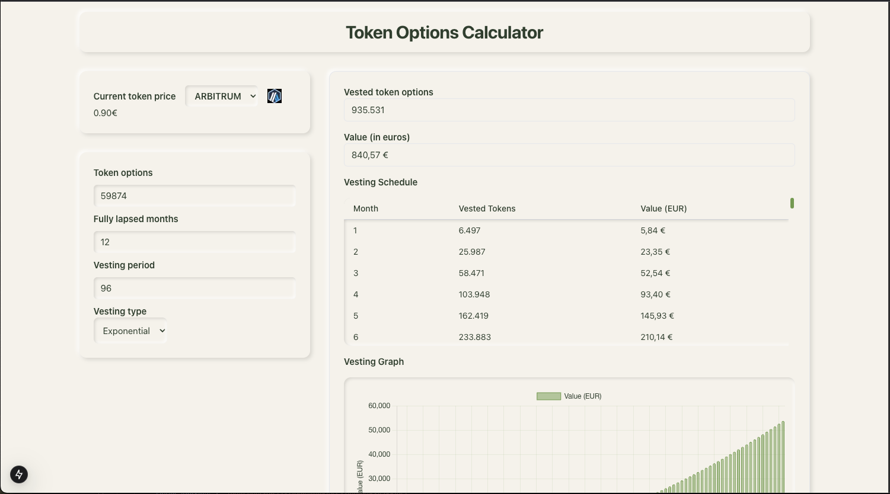

# Token Options Calculator

A webpage to help calculate the value of your token options depending on market price and vesting type

## Features

- Real-time token price fetching from CoinGecko API
- Multiple vesting calculation methods:
  - Linear vesting
  - Exponential vesting
- Interactive vesting schedule visualization
- Detailed monthly breakdown table

## Tech Stack

- **Frontend**: Next.js 15, React 19, TypeScript
- **Backend**: Express.js
- **Styling**: Tailwind CSS
- **Charts**: Chart.js
- **API**: CoinGecko API for real-time token data
